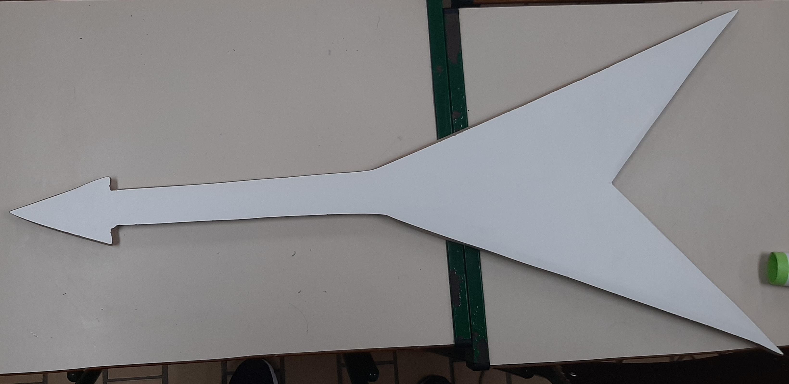
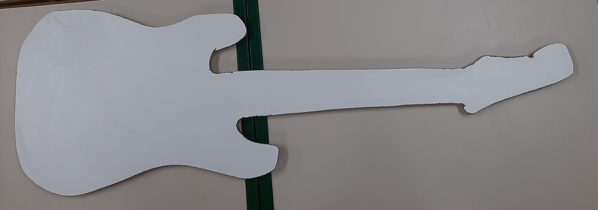
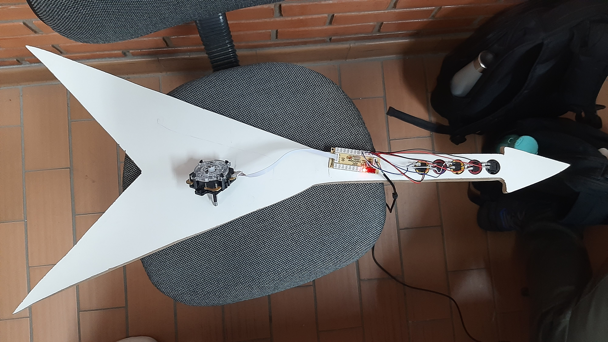
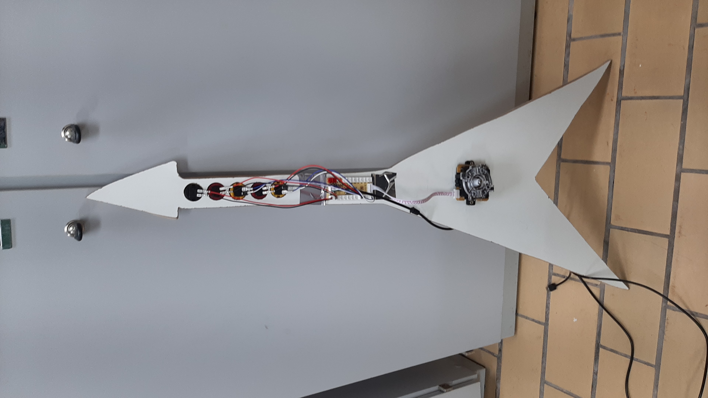

# Registro da Construção das guitarras
## Semana 14/10 a 18/10
Foram escolhidas as guitarras modelo V e Strato para primeiro corte.  
Foi feito um desenho por cima de uma tábua mdf de 15mm de espessura e cortada com serra tico tico.

Guitarras lixadas.

## Semana 11/11 a 15/11
Definidas as marcações para posicionar os botões e o joystick. Uso dos botões de 28mm, ao todo os 5 botões tem 18,5cm de comprimento

Guitarra finalizada com joystick e botões fixados (já é possível jogar):

